# Minikube with Docker on Windows ☸️


## What is Minikube?
Minikube is a tool that helps you run a local Kubernetes cluster on your machine. It's perfect for developers who want to experiment with Kubernetes without setting up a large cloud infrastructure. Minikube provides a simple way to start a Kubernetes cluster on a local machine, and it works with various drivers like Docker, VirtualBox, and Hyper-V.

Minikube makes Kubernetes accessible for local development, testing, and experimentation. It simplifies the process of deploying and managing Kubernetes clusters locally without the need for extensive resources.

## What is Kubernetes? ☸️
Kubernetes is an open-source platform for automating the deployment, scaling, and management of containerized applications. It orchestrates and manages containers (such as those created with Docker) to ensure that applications run reliably and efficiently, whether in a development, test, or production environment.

### Kubernetes allows you to:
- Deploy applications in containers across clusters.
- Scale applications up or down with ease.
- Manage containerized workloads with minimal effort.
- Ensure high availability, load balancing, and fault tolerance for your applications.

By using Kubernetes, developers can focus on writing code and let Kubernetes manage the complexity of application deployment and scaling.

---
## ✅ Step 1: Install Required Tools
Before starting, ensure you have the necessary software installed.

### 1. Install Docker Desktop 🐋
Minikube can run Kubernetes inside a Docker container, so install Docker Desktop:

- [Download Docker Desktop](https://www.docker.com/products/docker-desktop/)
- During installation:
  - **Enable WSL 2 backend** (recommended). ⚙️
  - If you have Windows Pro/Enterprise, **enable Hyper-V** (Docker will handle this). 🔧

### 2. Install Minikube 📦
To download and install Minikube, open **CMD** or **PowerShell** as Administrator and run the following command:

```powershell
choco install minikube
```
If you don't have **Chocolatey**, install Minikube manually from the [official website](https://minikube.sigs.k8s.io/docs/start/).

### 3. Install kubectl (Kubernetes CLI)
```powershell
choco install kubernetes-cli
```
Verify installation:
```powershell
kubectl version --client
```
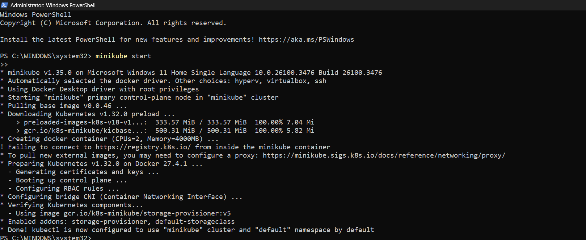
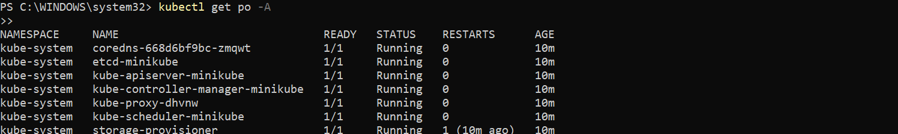
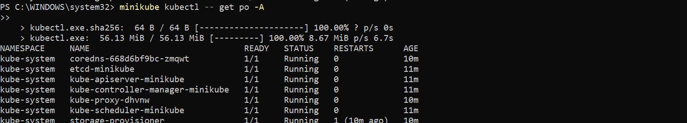
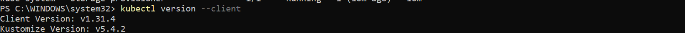

---
## ✅ Step 2: Start Minikube with Docker Driver 🐳
Now, start Minikube using Docker as the driver. Ensure that your Docker Engine (Docker Desktop) is running in the background.

### 1. Start Minikube
```powershell
minikube start --driver=docker
```
This initializes a Kubernetes cluster inside a Docker container instead of a virtual machine.
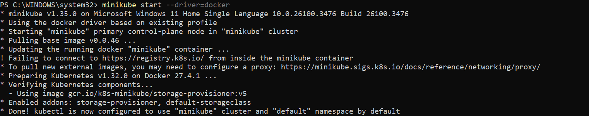


### 2. Check the status:
```powershell
minikube status
```
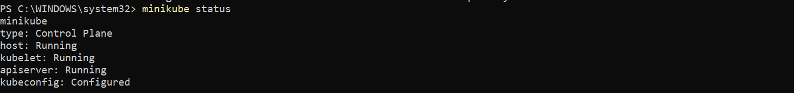

---
## ✅ Step 3: Deploy an Application 🚀
Deploy a simple **Nginx web server** inside Kubernetes.

### 1. Create an Nginx Deployment
```powershell
kubectl create deployment nginx --image=nginx
```

### 2. Expose the Deployment 🔓
```powershell
kubectl expose deployment nginx --type=NodePort --port=80
```

### 3. Get the Service URL 🔗
```powershell
minikube service nginx --url
```
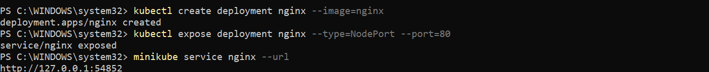
Open the given URL in your browser to see the running **Nginx web server**. 🌐


---
## ✅ Step 4: Manage Kubernetes Cluster
### 1. Check Running Pods 📋
```powershell
kubectl get pods
```
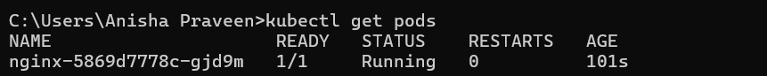

### 2. Scale the Deployment 📏
Scale to **3 replicas**:
```powershell
kubectl scale deployment nginx --replicas=3
```
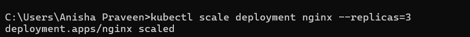
Check pods again:
```powershell
kubectl get pods
```
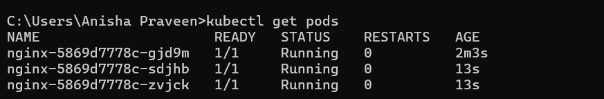

### 3. Delete the Deployment 🧹
```powershell
kubectl delete service nginx
kubectl delete deployment nginx
```
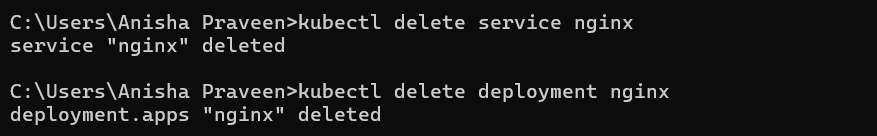

---
## ✅ Step 5: Stop and Delete Minikube 🗑️
### 1. Stop Minikube
```powershell
minikube stop
```
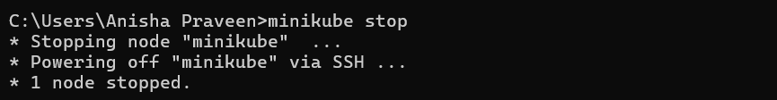

### 2. Delete the Cluster
```powershell
minikube delete
```
This removes all Kubernetes resources.

---
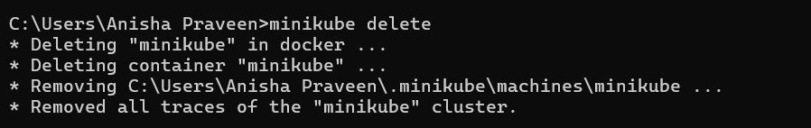
## 🎯 Conclusion
By using **Minikube with Docker**, you can run **Kubernetes locally** without needing **Hyper-V** or **VirtualBox**. Docker provides an easy way to manage your cluster and experiment with Kubernetes.

🚀😊 Happy Kubernetes Development!
